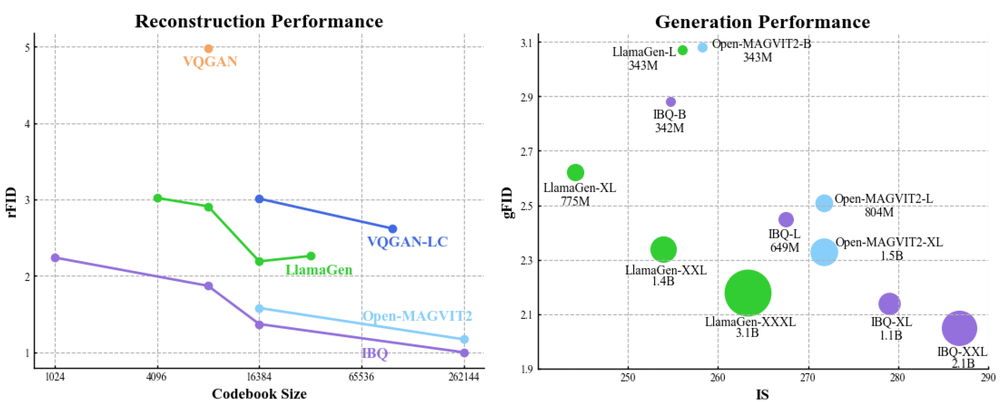

<div align="center">
<h1>🚀 SEED-Voken: A Series of Powerful Visual Tokenizers</h1>

</div>

The project aims to provide advanced visual tokenizers for autoregressive visual generation and currently supports the following methods: <br><br>

><a href="https://arxiv.org/abs/2409.04410">Open-MAGVIT2: An Open-source Project Toward Democratizing Auto-Regressive Visual Generation</a><br>
>[Zhuoyan Luo*](https://robertluo1.github.io/), [Fengyuan Shi*](https://shifengyuan1999.github.io/), [Yixiao Ge](https://geyixiao.com/), [Yujiu Yang](https://sites.google.com/view/iigroup-thu/people), [Limin Wang](https://wanglimin.github.io/), [Ying Shan](https://scholar.google.com/citations?user=4oXBp9UAAAAJ&hl=en)<br>
>ARC Lab Tencent PCG, Tsinghua University, Nanjing University<br>
<a href="./docs/Open-MAGVIT2.md">📚Open-MAGVIT2.md</a>
> ```
> @article{luo2024open,
>   title={Open-MAGVIT2: An Open-Source Project Toward Democratizing Auto-regressive Visual Generation},
>   author={Luo, Zhuoyan and Shi, Fengyuan and Ge, Yixiao and Yang, Yujiu and Wang, Limin and Shan, Ying},
>   journal={arXiv preprint arXiv:2409.04410},
>   year={2024}
> }
> ```

> <a href="https://arxiv.org/abs/2412.02692">IBQ: Taming Scalable Visual Tokenizer for Autoregressive Image Generation</a><br>
> [Fengyuan Shi*](https://shifengyuan1999.github.io/), [Zhuoyan Luo*](https://robertluo1.github.io/), [Yixiao Ge](https://geyixiao.com/), [Yujiu Yang](https://sites.google.com/view/iigroup-thu/people), [Ying Shan](https://scholar.google.com/citations?user=4oXBp9UAAAAJ&hl=en), [Limin Wang](https://wanglimin.github.io/)<br>
> Nanjing University, Tsinghua University, ARC Lab Tencent PCG<br>
> <a href="./docs/IBQ.md">📚IBQ.md</a>
> ```
> @article{shi2024taming,
>   title={Taming Scalable Visual Tokenizer for Autoregressive Image Generation},
>   author={Shi, Fengyuan and Luo, Zhuoyan and Ge, Yixiao and Yang, Yujiu and Shan, Ying and Wang, Limin},
>   journal={arXiv preprint arXiv:2412.02692},
>   year={2024}
> }
> ```

<p align="center">

</p>

## 📰 News
* **[2024.11.26]**:fire::fire::fire: We are excited to release **IBQ**, a series of scalable visual tokenizers, which achieve a large-scale codebook (2^18) with high dimension (256) and high utilization.
* **[2024.09.09]** We release an improved version of Open-MAGVIT2 tokenizer and a family of auto-regressive models ranging from 300M to 1.5B.
* **[2024.06.17]** We release the training code of the **Open-MAGVIT2** tokenizer and checkpoints for different resolutions, **achieving state-of-the-art performance (`0.39 rFID` for 8x downsampling)** compared to VQGAN, MaskGIT, and recent TiTok, LlamaGen, and OmniTokenizer.

## 📖 Implementations

**Our codebase supports both NPU and GPU for training and inference. All experiments were conducted using the Ascend 910B for training, and we validated our models on the V100. The observed performance between the two platforms is nearly identical.**

### 🛠️ Installation
#### GPU
- **Env**: We have tested on `Python 3.8.8` and `CUDA 11.8` (other versions may also be fine).
- **Dependencies**: `pip install -r requirements.txt`

#### NPU
- **Env**: `Python 3.9.16` and [`CANN 8.0.T13`](https://www.hiascend.com/en/software/cann)
- **Main Dependencies**: `torch=2.1.0+cpu` + `torch-npu=2.1.0.post3-20240523` + [`Lightning`](https://github.com/hipudding/pytorch-lightning/tree/npu_support)
- **Other Dependencies**: see in `requirements.txt`

#### Datasets

We use Imagenet2012 as our dataset.
```
imagenet
└── train/
    ├── n01440764
        ├── n01440764_10026.JPEG
        ├── n01440764_10027.JPEG
        ├── ...
    ├── n01443537
    ├── ...
└── val/
    ├── ...
```

### ⚡ Training & Evaluation
The training and evaluation scripts are in <a href="docs/Open-MAGVIT2.md">Open-MAGVIT2.md</a> and <a href="docs/IBQ.md">IBQ.md</a>.

## ❤️ Acknowledgement
We thank [Lijun Yu](https://me.lj-y.com/) for his encouraging discussions. We refer a lot from [VQGAN](https://github.com/CompVis/taming-transformers) and [MAGVIT](https://github.com/google-research/magvit). We also refer to [LlamaGen](https://github.com/FoundationVision/LlamaGen), [VAR](https://github.com/FoundationVision/VAR) and [RQVAE](https://github.com/kakaobrain/rq-vae-transformer). Thanks for their wonderful work.
