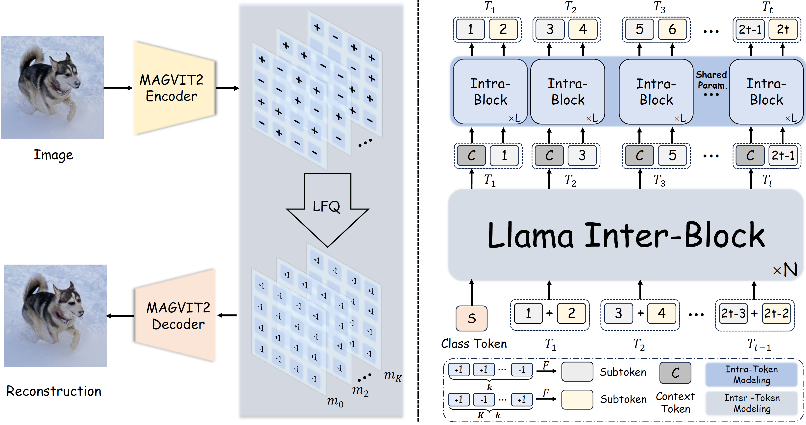

## OPEN-MAGVIT2: An Open-source Project Toward Democratizing Auto-Regressive Visual Generation
<p align="center">

</p>

<div align="center">

[](https://arxiv.org/pdf/2409.04410)&nbsp;

</div>

<div align="center">

> [**OPEN-MAGVIT2: An Open-source Project Toward Democratizing Auto-Regressive Visual Generation**](https://arxiv.org/pdf/2409.04410)<br>
> [Zhuoyan Luo](https://robertluo1.github.io/), [Fengyuan Shi](https://shifengyuan1999.github.io/), [Yixiao Ge](https://geyixiao.com/), [Yujiu Yang](https://sites.google.com/view/iigroup-thu/people), [Limin Wang](https://wanglimin.github.io/), [Ying Shan](https://scholar.google.com/citations?user=4oXBp9UAAAAJ&hl=en)
> <br>ARC Lab Tecent PCG, Tsinghua University, Nanjing University<br>
</div>

<p align="center">

</p>

We present Open-MAGVIT2, a family of auto-regressive image generation models ranging from 300M to 1.5B. The Open-MAGVIT2 project produces an open-source replication of Google's MAGVIT-v2 tokenizer, a tokenizer with a super-large codebook (i.e., $2^{18}$ codes), and achieves the state-of-the-art reconstruction performance (1.17 rFID) on ImageNet $256 \times 256$. Furthermore, we explore its application in plain auto-regressive models and validate scalability properties. To assist auto-regressive models in predicting with a super-large vocabulary, we factorize it into two sub-vocabulary of different sizes by asymmetric token factorization, and further introduce ''next sub-token prediction'' to enhance sub-token interaction for better generation quality.  We release all models and codes to foster innovation and creativity in the field of auto-regressive visual generation. :sparkling_heart:

### 📰 News
* **[2024.09.05]** :fire::fire::fire: We release a better image tokenizer and a family of auto-regressive models ranging from 300M to 1.5B.
* **[2024.06.17]** :fire::fire::fire: We release the training code of the image tokenizer and checkpoints for different resolutions, **achieving state-of-the-art performance (`0.39 rFID` for 8x downsampling)** compared to VQGAN, MaskGIT, and recent TiTok, LlamaGen, and OmniTokenizer.

### 🎤 TODOs
* [ &#10004; ] Better image tokenizer with scale-up training.
* [ &#10004; ] Finalize the training of the autoregressive model.
* [ ] Video tokenizer and the corresponding autoregressive model.

**🤗 Open-MAGVIT2 is still at an early stage and under active development. Stay tuned for the update!**


## 📖 Implementations

**Note that our experments are all using Ascned 910B for training. But we have tested our models on V100. The performance gap is narrow.**

**Figure 1.** The framework of the Open-MAGVIT2.

<p align="center">

</p>

### 🛠️ Installation
#### GPU
- **Env**: We have tested on `Python 3.8.8` and `CUDA 11.8` (other versions may also be fine).
- **Dependencies**: `pip install -r requirements.txt`

#### NPU
- **Env**: `Python 3.9.16` and [`CANN 8.0.T13`](https://www.hiascend.com/en/software/cann)
- **Main Dependencies**: `torch=2.1.0+cpu` + `torch-npu=2.1.0.post3-20240523` + [`Lightning`](https://github.com/hipudding/pytorch-lightning/tree/npu_support)
- **Other Dependencies**: see in `requirements.txt`

#### Datasets

We use Imagenet2012 as our dataset.
```
imagenet
└── train/
    ├── n01440764
        ├── n01440764_10026.JPEG
        ├── n01440764_10027.JPEG
        ├── ...
    ├── n01443537
    ├── ...
└── val/
    ├── ...
```

### Stage I: Training of Visual Tokenizer
<!-- * `Stage I Tokenizer Training`: -->
#### 🚀 Training Scripts
* $128\times 128$ Tokenizer Training
```
bash scripts/train_tokenizer/run_128_L.sh MASTER_ADDR MASTER_PORT NODE_RANK
```

* $256\times 256$ Tokenizer Training
```
bash scripts/train_tokenizer/run_256_L.sh MASTER_ADDR MASTER_PORT NODE_RANK
```

#### 🚀 Evaluation Scripts
* $128\times 128$ Tokenizer Evaluation
```
bash scripts/evaluation/evaluation_128.sh
```

* $256\times 256$ Tokenizer Evaluation
```
bash scripts/evaluation/evaluation_256.sh
```

#### 🍺 Performance and Models

**Tokenizer** 
| Method | Token Type | #Tokens | Train Data | Codebook Size | rFID | PSNR  | Codebook Utilization | Checkpoint |
|:------:|:----:|:-----:|:-----:|:-------------:|:----:|:----:|:---------------------:|:----:|
|Open-MAGVIT2-20240617| 2D | 16 $\times$ 16 | 256 $\times$ 256 ImageNet | 262144 | 1.53 | 21.53 | 100% | - |
|Open-MAGVIT2-20240617| 2D | 16 $\times$ 16 | 128 $\times$ 128 ImageNet | 262144 | 1.56 | 24.45 | 100% | - |
|Open-MAGVIT2| 2D | 16 $\times$ 16 | 256 $\times$ 256 ImageNet | 262144 | **1.17** | **21.90** | **100%** | [IN256_Large](https://huggingface.co/TencentARC/Open-MAGVIT2/blob/main/imagenet_256_L.ckpt)|
|Open-MAGVIT2| 2D | 16 $\times$ 16 | 128 $\times$ 128 ImageNet | 262144 | **1.18** | **25.08** | **100%** |[IN128_Large](https://huggingface.co/TencentARC/Open-MAGVIT2/blob/main/imagenet_128_L.ckpt)|
|Open-MAGVIT2*| 2D | 32 $\times$ 32 | 128 $\times$ 128 ImageNet | 262144 | **0.34** | **26.19** | **100%** |above|

(*) denotes that the results are from the direct inference using the model trained with $128 \times 128$ resolution without fine-tuning.

### Stage II: Training of Auto-Regressive Models

#### 🚀 Training Scripts
Please see in scripts/train_autogressive/run.sh for different model configurations.
```
bash scripts/train_autogressive/run.sh MASTER_ADDR MASTER_PORT NODE_RANK
```

#### 🚀 Sample Scripts
Please see in scripts/train_autogressive/run.sh for different sampling hyper-parameters for different scale of models.
```
bash scripts/evaluation/sample_npu.sh or scripts/evaluation/sample_gpu.sh Your_Total_Rank
```

#### 🍺 Performance and Models
| Method | Params| #Tokens | FID | IS | Checkpoint |
|:------:|:-----:|:-------:|:---:|:--:|:----------:|
|Open-MAGVIT2| 343M | 16 $\times$ 16 | 3.08 | 258.26 | [AR_256_B](https://huggingface.co/TencentARC/Open-MAGVIT2/blob/main/AR_256_B.ckpt)|
|Open-MAGVIT2| 804M | 16 $\times$ 16 | 2.51 | 271.70 | [AR_256_L](https://huggingface.co/TencentARC/Open-MAGVIT2/blob/main/AR_256_L.ckpt)|
|Open-MAGVIT2| 1.5B | 16 $\times$ 16 | 2.33 | 271.77 | [AR_256_XL](https://huggingface.co/TencentARC/Open-MAGVIT2/blob/main/AR_256_XL.ckpt)|

## ❤️ Acknowledgement
We thank [Lijun Yu](https://me.lj-y.com/) for his encouraging discussions. We refer a lot from [VQGAN](https://github.com/CompVis/taming-transformers) and [MAGVIT](https://github.com/google-research/magvit). We also refer to [LlamaGen](https://github.com/FoundationVision/LlamaGen), [VAR](https://github.com/FoundationVision/VAR) and [RQVAE](https://github.com/kakaobrain/rq-vae-transformer). Thanks for their wonderful work.

## ✏️ Citation
If you found the codebase and our work helpful, please cite it and give us a star :star:.
```
@article{luo2024open-magvit2,
  title={Open-MAGVIT2: An Open-Source Project Toward Democratizing Auto-Regressive Visual Generation},
  author={Luo, Zhuoyan and Shi, Fengyuan and Ge, Yixiao and Yang, Yujiu and Wang, Limin and Shan, Ying},
  journal={arXiv preprint arXiv:2409.04410},
  year={2024}
}
```

