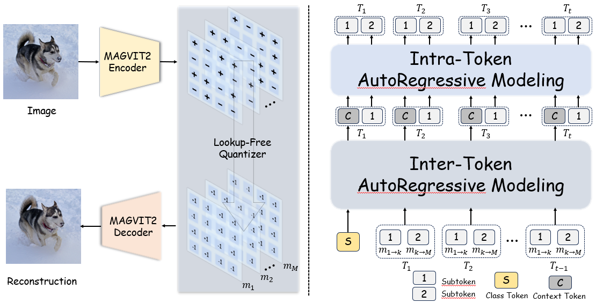

<div align="center">
<h2>OPEN-MAGVIT2: An Open-source Project Toward Democratizing Auto-Regressive Visual Generation</h2>

</div>

<div align="center">

<!-- > [**OPEN-MAGVIT2: An Open-source Project Toward Democratizing Auto-Regressive Visual Generation**](https://arxiv.org/abs/2409.04410)<br> -->
> [Zhuoyan Luo*](https://robertluo1.github.io/), [Fengyuan Shi*](https://shifengyuan1999.github.io/), [Yixiao Ge](https://geyixiao.com/), [Yujiu Yang](https://sites.google.com/view/iigroup-thu/people), [Limin Wang](https://wanglimin.github.io/), [Ying Shan](https://scholar.google.com/citations?user=4oXBp9UAAAAJ&hl=en)
> <br>ARC Lab Tencent PCG, Tsinghua University, Nanjing University<br>
</div>

<div align="center">

[](https://arxiv.org/abs/2409.04410)&nbsp;

</div>
This is the official repository for Open-MAGVIT2, an open-source project re-implementing Google's MAGVIT-v2 tokenizer and democratizing autoregressive visual generation with a super large vocabulary (i.e., 2^18).

<p align="center">

</p>

## **Highlights**
- 🚀 **Super-large Codebook**: Re-implements the advanced Lookup-Free Quantizer proposed by MAGVITv2, and achieves a super-large codebook (i.e., 2^18) with strong performance (1.17rFID).
- 💡 **Auto-Regressive Innovation**: Introduces asymmetric token factorization and the next sub-token prediction paradigm, enabling efficient generation with a super-large vocabulary and enhanced sub-token interactions.
- 🚀 **Scalability**: Validates the scalability of plain auto-regressive models across various parameter sizes (300M to 1.5B).

<p align="center">

</p>

This repository provides the scripts and checkpoints to replicate our results.


### 🎤 TODOs
* [ &#10004; ] Better image tokenizer with scale-up training.
* [ &#10004; ] Finalize the training of the autoregressive model.
* [ ] Video tokenizer and the corresponding autoregressive model.

**🤗 Open-MAGVIT2 is still at an early stage and under active development. Stay tuned for the update!**

---

## 🔥 Quick Start
<!-- * `Stage I Tokenizer Training`: -->

### Stage I: Training of Visual Tokenizer

#### 🚀 Training Scripts
* $128\times 128$ Tokenizer Training
```
bash scripts/train_tokenizer/Open-MAGVIT2/run_128_L.sh MASTER_ADDR MASTER_PORT NODE_RANK
```

* $256\times 256$ Tokenizer Training
```
bash scripts/train_tokenizer/run_256_L.sh MASTER_ADDR MASTER_PORT NODE_RANK
```
#### 🚀 Evaluation Scripts
* $128\times 128$ Tokenizer Evaluation
```
bash scripts/evaluation/evaluation_128.sh
```

* $256\times 256$ Tokenizer Evaluation
```
bash scripts/evaluation/evaluation_256.sh
```

#### 🍺 Performance and Models

**Tokenizer** 

| Method | Token Type | #Tokens | Train Data | Codebook Size | rFID | PSNR  | Codebook Utilization | Checkpoint |
|:------:|:----:|:-----:|:-----:|:-------------:|:----:|:----:|:---------------------:|:----:|
|Open-MAGVIT2-20240617| 2D | 16 $\times$ 16 | 256 $\times$ 256 ImageNet | 262144 | 1.53 | 21.53 | 100% | - |
|Open-MAGVIT2-20240617| 2D | 16 $\times$ 16 | 128 $\times$ 128 ImageNet | 262144 | 1.56 | 24.45 | 100% | - |
|Open-MAGVIT2| 2D | 16 $\times$ 16 | 256 $\times$ 256 ImageNet | 262144 | **1.17** | **21.90** | **100%** | [IN256_Large](https://huggingface.co/TencentARC/Open-MAGVIT2-Tokenizer-256-resolution/blob/main/imagenet_256_L.ckpt)|
|Open-MAGVIT2| 2D | 16 $\times$ 16 | 128 $\times$ 128 ImageNet | 262144 | **1.18** | **25.08** | **100%** |[IN128_Large](https://huggingface.co/TencentARC/Open-MAGVIT2-Tokenizer-128-resolution/blob/main/imagenet_128_L.ckpt)|
|Open-MAGVIT2*| 2D | 32 $\times$ 32 | 128 $\times$ 128 ImageNet | 262144 | **0.34** | **26.19** | **100%** |above|

(*) denotes that the results are from the direct inference using the model trained with $128 \times 128$ resolution without fine-tuning.
### Stage II: Training of Auto-Regressive Models

#### 🚀 Training Scripts
Please see in scripts/train_autogressive/run.sh for different model configurations.
```
bash scripts/train_autogressive/run.sh MASTER_ADDR MASTER_PORT NODE_RANK
```

#### 🚀 Sample Scripts
Please see in scripts/train_autogressive/run.sh for different sampling hyper-parameters for different scale of models.
```
bash scripts/evaluation/sample_npu.sh or scripts/evaluation/sample_gpu.sh Your_Total_Rank
```

#### 🍺 Performance and Models
| Method | Params| #Tokens | FID | IS | Checkpoint |
|:------:|:-----:|:-------:|:---:|:--:|:----------:|
|Open-MAGVIT2| 343M | 16 $\times$ 16 | 3.08 | 258.26 | [AR_256_B](https://huggingface.co/TencentARC/Open-MAGVIT2-AR-B-256-resolution/blob/main/AR_256_B.ckpt)|
|Open-MAGVIT2| 804M | 16 $\times$ 16 | 2.51 | 271.70 | [AR_256_L](https://huggingface.co/TencentARC/Open-MAGVIT2-AR-L-256-resolution/blob/main/AR_256_L.ckpt)|
|Open-MAGVIT2| 1.5B | 16 $\times$ 16 | 2.33 | 271.77 | [AR_256_XL](https://huggingface.co/TencentARC/Open-MAGVIT2-AR-XL-256-resolution/blob/main/AR_256_XL.ckpt)|
